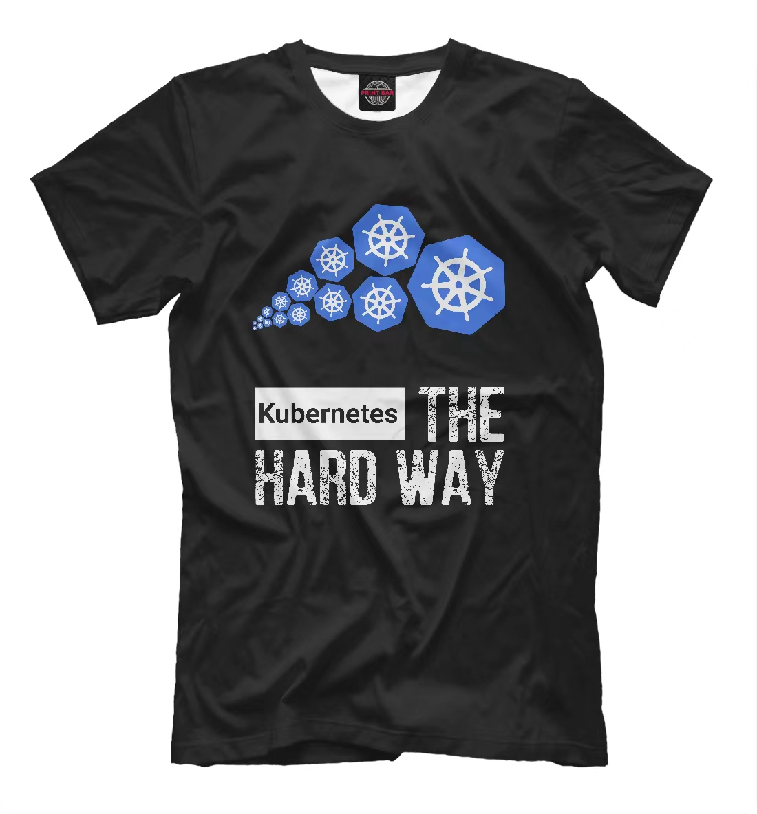

##                   声援乌克兰，反对战争，守护世界和平! 

​         **战争没有赢家，受伤的永远是平民！俄罗斯的侵略旨在摧毁一个作为主权独立国家的乌克兰，将导致可怕的人道主义灾难！**

## Kubernetes The Hard Way(中文版)

​     本教程将引导您以Kubernetes The Hard Way(困难模式)以二进制方式部署设置 Kubernetes。本指南不适用于寻求全自动命令来启动 Kubernetes 集群的人。本教程针对学习进行了优化，这意味着要确保您了解引导 Kubernetes 集群所需的每项任务; 同时注重通过对kubernetes原理及工作 流阐述，努力成为`kubernetes`基于生产环境的最佳实践。

- **集群特性** `TLS`双向认证、`RBAC`授权、[Master高可用](docs/setup/00-planning_and_overall_intro.md#ha-architecture)、支持`Network Policy`
- **集群版本** kubernetes v1.24.x
- **操作系统** CentOS/RedHat/Rocky Linux 8,
- **运行时** [containerd](docs/setup/03-container_runtime.md) 
- **网络** [calico](docs/setup/network-plugin/calico.md)

## 沟通交流

- 微信：solaris10

- 邮件: orasun@vip.qq.com

- 捐赠：如果觉得本项目对您有帮助，请小小鼓励下项目作者，谢谢！

  支付宝码(左)和微信钱包码(右)

   `

## 安装指南

<table border="0">
    <tr>
        <td><a href="docs/setup/00-planning_and_overall_intro.md">00-规划集群和配置介绍</a></td>
        <td><a href="docs/setup/02-install_etcd.md">02-安装etcd集群</a></td>
        <td><a href="docs/setup/04-install_kube_master.md">04-安装master节点</a></td>
        <td><a href="docs/setup/06-install_network_plugin.md">06-安装集群网络</a></td>
    </tr>
    <tr>
        <td><a href="docs/setup/01-CA_and_prerequisite.md">01-创建证书和安装准备</a></td>
        <td><a href="docs/setup/03-container_runtime.md">03-安装容器运行时</a></td>
        <td><a href="docs/setup/05-install_kube_node.md">05-安装node节点</a></td>
        <td><a href="docs/setup/07-install_cluster_addon.md">07-安装集群插件</a></td>
    </tr>
</table>

## 使用指南

<table border="0">
    <tr>
        <td><strong>常用插件</strong><a href="docs/guide/index.md">+</a></td>
        <td><a href="docs/guide/kubedns.md">DNS</a></td>
        <td><a href="docs/guide/dashboard.md">dashboard</a></td>
        <td><a href="docs/guide/metrics-server.md">metrics-server</a></td>
        <td><a href="docs/guide/prometheus.md">prometheus</a></td>
        <td><a href="docs/guide/efk.md">efk</a></td>
    </tr>
    <tr>
        <td><strong>集群管理</strong><a href="docs/op/op-index.md">+</a></td>
        <td><a href="docs/op/op-node.md">管理node节点</a></td>
        <td><a href="docs/op/op-master.md">管理master节点</a></td>
        <td><a href="docs/op/op-etcd.md">管理etcd节点</a></td>
        <td><a href="docs/op/upgrade.md">升级集群</a></td>
        <td><a href="docs/op/cluster_restore.md">备份恢复</a></td>
    </tr>
    <tr>
        <td><strong>特性实验</strong></td>
        <td><a href="docs/guide/networkpolicy.md">NetworkPolicy</a></td>
        <td><a href="docs/guide/rollingupdateWithZeroDowntime.md">RollingUpdate</a></td>
        <td><a href="docs/guide/hpa.md">HPA</a></td>
        <td></td>
        <td></td>
    </tr>
    <tr>
        <td><strong>周边生态</strong></td>
        <td><a href="docs/guide/harbor.md">harbor</a></td>
        <td><a href="docs/guide/helm.md">helm</a></td>
        <td><a href="docs/guide/jenkins.md">jenkins</a></td>
        <td><a href="docs/guide/gitlab/readme.md">gitlab</a></td>
        <td></td>
    </tr>
</table>
- 

## 贡献&致谢

请阅读[项目分支说明](docs/mixes/branch.md), 欢迎提[Issues](https://github.com/easzlab/kubeasz/issues)和[PRs](docs/mixes/HowToContribute.md)参与维护项目！感谢您的关注与支持！

参考资料

- [kubernetes-the-hard-way](https://github.com/kelseyhightower/kubernetes-the-hard-way)
- [opsnull 安装教程](https://github.com/opsnull/follow-me-install-kubernetes-cluster)

Copyright 2021 orasun (orasun@vip.qq.com) Apache License 2.0, 详情见 [LICENSE](docs/mixes/LICENSE) 文件。
